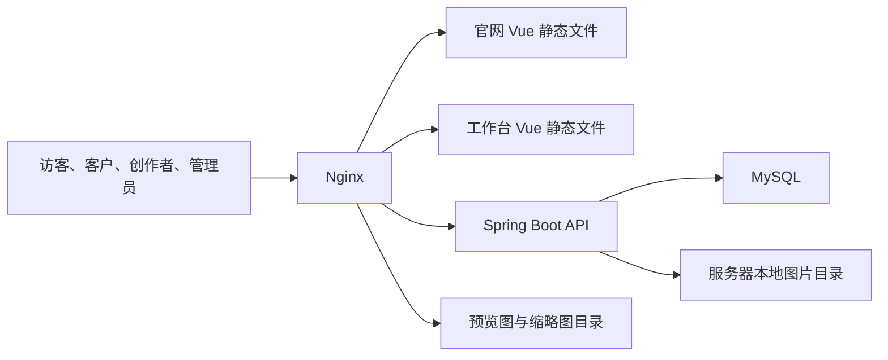

# 婚礼作品展示与云相册平台方案

版本：V1.1
日期：2026-07-18
状态：持续确认稿

## 1. 项目概述

### 1.1 项目定位

建设一套婚礼行业的“品牌官网 + 云相册内容平台”，用于展示：

- 婚礼跟拍。
- 订婚返图。
- 婚纱摄影。
- 化妆造型。
- 婚礼策划与布置。
- 客户评价。

平台同时为管理员、摄影师、化妆师、策划师等创作者提供作品上传、多人协作、审核、发布和下架能力，并为客户提供项目关联和评价能力。

### 1.2 核心目标

1. 通过高质量图片官网展示婚礼项目与作品。
2. 让不同类型创作者使用独立账号维护作品。
3. 所有公开内容必须经过管理员审核和发布。
4. 支持图片和字段级审核，但以整套作品集为发布单位。
5. 形成从项目创建、多人创作、审核到客户反馈的完整闭环。
6. 第一阶段保持架构简单，适合少量账号和较低内容增量。
7. 以“糖诗·美学”为统一品牌，官网、工作台、图片水印和浏览器标识使用一致的视觉语言。

### 1.3 品牌定位

- 正式中文品牌名：`糖诗·美学`，中间使用中文间隔号 `·`。
- 中文品牌名是官网和工作台的第一识别信息，不再以 `Wedding Archive`、
  `Wedding Console` 或 `WA` 作为主品牌。
- 可使用 `TANGSHI AESTHETICS` 作为小尺寸英文辅助字，不得替代中文品牌名。
- 品牌气质为诗意、精致、温暖和专业克制，避免俗套婚礼符号、过度甜腻粉色、炫光渐变和
  难以阅读的装饰字体。
- Logo、品牌应用和后台登录页详细要求见
  [品牌与后台登录页设计要求](品牌与后台登录页设计要求.md)。

### 1.4 第一阶段不包含

- 视频作品。
- 原图下载。
- 点赞、收藏和普通访客评论。
- 档期查询、报价、订单、订金和在线支付。
- 邮件、短信或微信通知。
- 分享二维码。
- 动态系统权限角色配置页面。
- 搜索引擎优化专项能力。

## 2. 总体产品结构

```text
婚礼平台
├── 公开官网
│   ├── 首页
│   ├── 婚礼项目
│   ├── 作品中心
│   ├── 搜索与筛选
│   ├── 客户评价
│   └── 咨询提交
├── 客户中心
│   ├── 注册与登录
│   ├── 项目关联申请
│   ├── 已关联项目
│   ├── 我的评价
│   └── 站内消息
└── 管理与创作工作台
    ├── 管理员功能
    ├── 创作者功能
    ├── 内容审核
    ├── 官网运营
    └── 数据统计与审计
```

## 3. 用户与角色模型

### 3.1 系统权限角色

第一阶段固定三种系统权限角色：

| 系统角色 | 定位 |
| --- | --- |
| 管理员 | 账号、审核、发布、运营、统计和系统配置 |
| 创作者 | 创建项目、共同维护作品、上传图片和提交审核 |
| 客户 | 申请关联项目、评价创作者和查看自己的记录 |

系统权限角色第一阶段固定，不提供动态创建页面。

### 3.2 职业角色

职业角色与系统权限角色分开：

- 职业角色包括摄影师、化妆师、策划师等。
- 管理员可以新增、编辑、排序和停用职业角色。
- 一个创作者可以拥有多个职业角色。
- 职业角色由管理员分配。
- 职业角色只用于作品归属、参与者标识和官网展示。
- 职业角色不直接决定后台菜单权限。

### 3.3 账号规则

#### 管理员

- 所有管理员拥有相同权限。
- 不细分超级管理员、审核员或运营人员。

#### 创作者

- 账号由管理员统一开通。
- 手机号作为登录账号。
- 使用手机号和密码登录。
- 首次登录必须修改初始密码。
- 首次登录必须完善头像、姓名、职位等资料。
- 未完成首次登录流程时不能进入工作台。

#### 客户

- 客户自行注册。
- 使用手机号和密码登录。
- 第一阶段不使用短信验证码。
- 忘记密码时由管理员人工核验并重置。

#### 普通访客

- 无需注册即可浏览公开内容。
- 可以输入访问密码浏览密码作品。
- 可以提交婚礼咨询。
- 不能点赞、收藏或评论。

## 4. 权限设计

### 4.1 权限底座

权限实现参考现有 `pi-paltform` 项目的 RBAC 思路：

```text
用户
  ↓ 多对多
系统角色
  ↓ 多对多
权限资源
```

采用以下原则：

- 前端路由与菜单根据权限资源控制可见性。
- 后端接口使用 Spring Security 方法级权限强制校验。
- 不能只依赖前端隐藏按钮。
- JWT 中携带可信用户身份与权限资源。
- 角色权限和关键业务操作保留审计记录。

建议的权限资源示例：

```text
/dashboard
/content/projects
/content/collections
/review/projects
/review/collections
/review/feedback
/accounts/creators
/accounts/customers
/config/professional-roles
/config/categories
/config/tags
/site/home
/site/themes
/operations/inquiries
/operations/messages
/analytics
/system/audit
```

### 4.2 数据范围权限

资源权限解决“能否使用功能”，数据范围解决“能操作哪些数据”。

| 数据对象 | 管理员 | 创作者 | 客户 |
| --- | --- | --- | --- |
| 婚礼项目 | 全部 | 自己创建或被分配参与的项目 | 仅自己的关联记录 |
| 作品集 | 全部 | 自己参与的作品集 | 无维护权限 |
| 图片 | 全部 | 自己参与作品集中的图片 | 无维护权限 |
| 客户评价 | 全部 | 与自己相关的评价和回复 | 自己提交的评价 |
| 咨询线索 | 全部 | 无 | 无 |
| 操作日志 | 全部 | 无 | 无 |

共同创作的作品集：

- 所有被关联创作者均可上传、删除、排序和修改。
- 任意一位共同创作者均可提交审核。
- 使用数据库乐观锁避免多人同时保存时互相覆盖。

共同参与的婚礼项目：

- 所有被管理员加入项目的创作者都可以维护项目公共资料。
- 项目处于已发布状态时，公共资料对所有创作者锁定。
- 管理员下架项目后，参与创作者才能继续修改并提交审核。
- 项目公共资料同样使用数据库乐观锁避免多人保存时互相覆盖。

### 4.3 权限矩阵

| 功能 | 管理员 | 创作者 | 客户 | 访客 |
| --- | --- | --- | --- | --- |
| 浏览公开官网 | 是 | 是 | 是 | 是 |
| 浏览密码内容 | 输入密码 | 输入密码 | 输入密码 | 输入密码 |
| 查看完全隐藏内容 | 是 | 仅参与内容 | 否 | 否 |
| 创建婚礼项目 | 是 | 是 | 否 | 否 |
| 分配项目参与者 | 是 | 否 | 否 | 否 |
| 创建独立作品集 | 是 | 是 | 否 | 否 |
| 共同维护作品集 | 是 | 仅参与内容 | 否 | 否 |
| 上传和排序图片 | 是 | 仅参与内容 | 否 | 否 |
| 提交作品审核 | 是 | 仅参与内容 | 否 | 否 |
| 审核项目和作品 | 是 | 否 | 否 | 否 |
| 设置内容可见性 | 是 | 否 | 否 | 否 |
| 发布和下架 | 是 | 否 | 否 | 否 |
| 维护分类、标签和职业角色 | 是 | 否 | 否 | 否 |
| 申请关联项目 | 否 | 否 | 是 | 否 |
| 审核客户关联 | 是 | 否 | 否 | 否 |
| 提交客户评价 | 可代提交 | 可代提交 | 是 | 否 |
| 审核客户评价 | 是 | 否 | 否 | 否 |
| 回复客户评价 | 否 | 仅与自己相关 | 否 | 否 |
| 提交咨询 | 否 | 否 | 是 | 是 |
| 查看统计和审计 | 是 | 否 | 否 | 否 |

## 5. 页面结构

### 5.1 公开官网

#### 首页

- 当前主题下的首页视觉。
- 轮播或精选婚礼项目。
- 推荐作品集。
- 作品分类入口。
- 精选客户评价。
- 咨询入口。
- 管理员可设置推荐、置顶和顺序。
- 未手动设置时按发布时间倒序。

#### 婚礼项目列表

- 项目封面、名称、日期、地点和标签。
- 按分类、标签、地区等条件筛选。
- 支持关键词搜索。

#### 婚礼项目详情

- 新人脱敏名称或项目标题。
- 日期、地点、项目介绍和参与创作者。
- 项目下已经发布的作品集。
- 已审核公开的客户评价。
- 项目可公开、密码访问或完全隐藏。

#### 作品中心

- 瀑布流或网格展示作品集。
- 支持分类、标签、创作者和地区筛选。
- 支持关键词搜索。
- 支持推荐和置顶排序。

#### 作品集详情

- 封面、标题、介绍、分类和标签。
- 参与创作者姓名与职业角色。
- 缩略图和带统一水印的预览图。
- 图片懒加载和大图预览。
- 不提供原图下载入口。

#### 密码访问页

- 输入访问密码。
- 密码正确后建立短期访问会话。
- 密码使用哈希保存，不在数据库存储明文。

#### 客户评价

- 展示审核通过的文字与星级评价。
- 客户姓名统一脱敏。
- 展示审核通过的创作者回复。

#### 咨询页

- 姓名。
- 联系方式。
- 婚期。
- 地区。
- 服务需求。
- 补充说明。

### 5.2 客户中心

#### 注册与登录

- 手机号和密码注册。
- 手机号和密码登录。
- 不发送短信验证码。

#### 个人资料

- 昵称。
- 手机号。
- 密码修改。

#### 项目关联

- 输入管理员提供的项目编号。
- 填写申请说明。
- 查看待审核、已通过和已驳回状态。

#### 已关联项目

- 查看关联项目的基本信息。
- 完全隐藏内容不向客户展示。
- 关联关系仍可用于评价项目参与创作者。

#### 我的评价

- 选择已关联项目中的创作者。
- 填写文字和星级。
- 同一客户可对同一创作者提交多条评价。
- 审核通过并公开前允许修改或撤回。
- 审核通过并公开后锁定，只能由管理员下架。
- 查看审核状态和驳回原因。

#### 站内消息

- 项目关联审核结果。
- 评价审核结果。
- 评价下架等状态通知。

### 5.3 管理员与创作者共用工作台

管理员和创作者使用同一个登录入口，根据权限显示不同菜单。

#### 公共页面

- 登录。
- 首次修改密码。
- 首次完善资料。
- 工作台首页。
- 我的资料。
- 站内消息。

工作台登录页必须使用“糖诗·美学”品牌，不再展示临时英文品牌和 `WA` 字样；登录表单保持
手机号和密码流程不变，并补齐密码显隐、加载、明确错误、键盘操作和手机端适配。

#### 创作者页面

- 我的婚礼项目。
- 创建和编辑婚礼项目。
- 我的作品集。
- 共同创作作品集。
- 图片批量上传、排序和封面设置。
- 草稿、待审核、被驳回、可发布、已发布、已下架列表。
- 审核意见。
- 客户评价与公开回复。

#### 管理员页面

- 运营看板。
- 创作者账号管理。
- 客户账号管理。
- 职业角色管理。
- 婚礼项目管理。
- 项目参与者分配。
- 作品集管理。
- 图片批量审核。
- 项目和作品发布、下架。
- 客户项目关联审核。
- 客户评价和创作者回复审核。
- 分类管理。
- 标签管理。
- 首页内容运营。
- 官网主题切换。
- 咨询线索管理。
- 站内消息。
- 数据统计。
- 操作审计。

## 6. 业务对象

### 6.1 婚礼项目

婚礼项目代表一场婚礼或订婚活动，保存公共资料：

- 项目编号。
- 项目名称。
- 新人脱敏名称。
- 婚礼或拍摄日期。
- 地区和详细地点。
- 项目介绍。
- 封面。
- 参与创作者。
- 可见性。
- 审核状态。
- 发布状态。

创作者可以创建项目，其他参与者由管理员分配。所有项目参与创作者都可以共同维护项目公共资料，并可提交审核。

### 6.2 作品集

作品集可以：

- 归属于一个婚礼项目。
- 作为不关联婚礼项目的独立作品集存在。

作品集包含：

- 标题。
- 介绍。
- 一个主分类。
- 多个标签。
- 多位共同创作者。
- 封面。
- 图片。
- 可见性。
- 审核与发布状态。

### 6.3 图片

- 一个作品集通常包含几十张图片。
- 图片批量上传。
- 每张图片独立审核。
- 作品集整体发布。
- 原图、预览图和缩略图分别保存。
- 逻辑删除后文件长期保留。

## 7. 审核模型

### 7.1 设计原则

审核状态与发布状态分离：

```text
审核状态：草稿 → 待审核 → 部分驳回/全部通过
发布状态：未发布 → 可发布 → 已发布 → 已下架
```

这样可以同时支持：

- 图片和字段分别审核。
- 被驳回内容单独重新提交。
- 作品集必须整体发布。
- 已发布婚礼项目继续增加新作品集。

### 7.2 审核项

管理员审核的最小单位包括：

- 项目字段。
- 作品集字段。
- 封面。
- 单张图片。
- 客户评价。
- 创作者回复。

每个审核项保存：

- 内容快照。
- 当前审核状态。
- 提交版本。
- 审核人。
- 审核时间。
- 驳回原因。

### 7.3 图片批量审核

- 管理员可多选图片批量通过。
- 管理员可多选图片批量驳回。
- 批量驳回必须填写原因。
- 一个作品集中只要存在待审核或被驳回图片，就不能发布。
- 不允许先发布部分已通过图片。

### 7.4 被驳回内容处理

#### 删除被驳回图片

```text
图片被驳回
  ↓
创作者删除被驳回图片
  ↓
系统重新计算作品集审核状态
  ↓
不存在待审核或驳回项
  ↓
自动进入可发布状态
  ↓
管理员手动发布
```

#### 替换被驳回图片

```text
图片被驳回
  ↓
创作者替换或重新上传
  ↓
仅新图片进入待审核
  ↓
原已通过图片不重复审核
```

#### 修改被驳回字段

- 只重新审核被驳回的字段。
- 已通过且未修改的字段保留审核结果。

### 7.5 发布锁定

- 作品集发布后，创作者不能修改内容。
- 管理员下架后，创作者才能修改。
- 只重新审核本次被修改的内容。
- 全部通过后由管理员手动重新发布。

婚礼项目公共资料遵循相同规则：

- 项目发布后公共资料锁定。
- 必须由管理员下架后才能修改。
- 修改后重新审核。

项目发布后仍允许：

- 管理员添加新的参与创作者。
- 在项目下新增作品集。
- 部分作品集先发布，其他作品集继续编辑或审核。
- 上述操作不要求将整个项目下架。

## 8. 内容可见性

| 可见性 | 访问规则 |
| --- | --- |
| 公开 | 所有访客可访问 |
| 密码访问 | 无需登录，输入正确访问密码后访问 |
| 完全隐藏 | 只有管理员和关联创作者可访问 |

补充规则：

- 可见性只能由管理员设置。
- 客户即使已关联项目，也不能查看完全隐藏内容。
- 客户仍可基于已审核关联关系评价项目参与创作者。
- 原图无论何种可见性都不对外提供下载。

## 9. 客户反馈流程

```text
客户注册
  ↓
输入项目编号申请关联
  ↓
管理员审核关联申请
  ↓
客户选择项目参与创作者
  ↓
提交文字与星级评价
  ↓
管理员审核
  ├── 驳回：客户修改后重新提交
  └── 通过：官网公开并锁定
                ↓
          创作者提交回复
                ↓
          管理员审核回复
                ↓
             官网公开
```

规则：

- 客户评价在官网统一脱敏展示。
- 同一客户可对同一创作者提交多条评价。
- 创作者可以代客户提交评价材料，但同样需要审核。
- 客户评价审核公开前允许修改或撤回。
- 公开后只能由管理员下架。

## 10. 站内消息

第一阶段只实现站内消息。

消息场景：

- 新项目或作品审核任务。
- 审核通过或驳回。
- 被加入或移出项目、作品集。
- 项目或作品发布、下架。
- 客户项目关联申请及结果。
- 新客户评价及审核结果。
- 创作者回复及审核结果。
- 新咨询线索。

消息至少支持：

- 未读数量。
- 消息列表。
- 单条已读。
- 全部已读。
- 点击消息跳转到对应业务页面。

## 11. 官网运营与统计

### 11.1 首页运营

- 首页轮播。
- 推荐婚礼项目。
- 推荐作品集。
- 精选客户评价。
- 默认按发布时间倒序。
- 管理员可置顶、推荐和手动排序。

第一阶段品牌名称和 Logo 固定为“糖诗·美学”，不提供后台动态修改；宣传语、主色和联系方式
同样不提供后台动态配置。品牌变更通过前端设计令牌和版本化静态资源发布。

### 11.2 品牌视觉

- 官网页头、首页首屏、页尾、浏览器标题和 favicon 使用统一品牌标识。
- 工作台登录、首次资料完善、侧边导航和浏览器标题使用统一品牌标识。
- Logo 至少提供横版组合标、方形标志、深浅背景版本和单色版本。
- 新生成的预览图使用品牌水印；既有预览图是否重处理必须在上线前形成明确迁移和回滚方案。
- 品牌视觉不得降低官网图片可读性，也不得降低后台高频操作的扫描效率。
- 详细视觉方向、资源交付和验收清单见
  [品牌与后台登录页设计要求](品牌与后台登录页设计要求.md)。

### 11.3 主题

预置多套完整官网主题，例如：

- 婚礼杂志。
- 清新温柔。
- 极简黑白。

规则：

- 由管理员全站切换。
- 访客不能自行切换。
- 切换主题不改变业务内容。
- 主题通过统一设计令牌控制颜色、字体、间距和组件样式。

### 11.4 数据统计

管理员看板包含：

- 官网访问量。
- 婚礼项目浏览量。
- 作品集浏览量。
- 咨询线索数量。
- 待审核数量。
- 创作者上传数量。
- 已发布、已下架和被驳回内容数量。
- 一段时间内的变化趋势。

第一阶段以业务统计为主，不建设复杂用户画像。

## 12. 数据库设计

### 12.1 通用字段

核心业务表建议统一包含：

```text
id                bigint
created_at        datetime
created_by        bigint
updated_at        datetime
updated_by        bigint
version           bigint      # 乐观锁
is_deleted        boolean     # 逻辑删除
deleted_at        datetime
```

物理图片长期保留，业务记录只做逻辑删除。

### 12.2 用户与权限

#### `sys_user`

| 字段 | 说明 |
| --- | --- |
| id | 用户编号 |
| mobile | 登录手机号，唯一 |
| password_hash | 密码摘要 |
| user_type | ADMIN、CREATOR、CUSTOMER |
| avatar_path | 头像 |
| display_name | 展示姓名 |
| account_status | ACTIVE、DISABLED |
| must_change_password | 是否必须修改初始密码 |
| profile_completed | 是否完成首次资料 |
| last_login_at | 最后登录时间 |

#### `sys_role`

- `id`
- `code`
- `name`
- `status`

第一阶段初始化 `ADMIN`、`CREATOR`、`CUSTOMER`。

#### `sys_permission`

- `id`
- `name`
- `resource`
- `parent_id`
- `route`
- `component`
- `icon`
- `sort_order`
- `status`

#### `sys_user_role`

- `user_id`
- `role_id`
- 唯一索引：`user_id + role_id`

#### `sys_role_permission`

- `role_id`
- `permission_id`
- 唯一索引：`role_id + permission_id`

#### `creator_profile`

- `user_id`
- `introduction`
- `position_text`
- `service_area`

#### `professional_role`

- `id`
- `name`
- `description`
- `sort_order`
- `status`

#### `creator_professional_role`

- `creator_user_id`
- `professional_role_id`
- 唯一索引：`creator_user_id + professional_role_id`

#### `customer_profile`

- `user_id`
- `nickname`

### 12.3 项目与作品

#### `wedding_project`

| 字段 | 说明 |
| --- | --- |
| id | 项目编号 |
| project_code | 提供给客户的唯一关联编号 |
| title | 项目标题 |
| couple_display_name | 新人脱敏展示名称 |
| event_date | 婚礼或拍摄日期 |
| region_code | 地区编码 |
| location_text | 地点 |
| description | 项目介绍 |
| cover_asset_id | 封面资源 |
| visibility | PUBLIC、PASSWORD、HIDDEN |
| access_password_hash | 访问密码摘要 |
| review_status | 审核状态 |
| publish_status | 发布状态 |
| published_at | 发布时间 |
| published_by | 发布管理员 |
| offline_reason | 下架原因 |

索引：

- `project_code` 唯一索引。
- `publish_status + published_at`。
- `region_code + publish_status`。

#### `project_creator`

- `project_id`
- `creator_user_id`
- `assigned_by`
- `assigned_at`
- 唯一索引：`project_id + creator_user_id`

#### `work_collection`

| 字段 | 说明 |
| --- | --- |
| id | 作品集编号 |
| project_id | 可为空，空值表示独立作品集 |
| title | 标题 |
| description | 介绍 |
| category_id | 唯一主分类 |
| cover_photo_id | 封面图片 |
| visibility | PUBLIC、PASSWORD、HIDDEN |
| access_password_hash | 访问密码摘要 |
| review_status | 审核状态 |
| publish_status | 发布状态 |
| published_at | 发布时间 |
| sort_order | 手动排序 |
| is_featured | 是否推荐 |
| is_pinned | 是否置顶 |

#### `collection_creator`

- `collection_id`
- `creator_user_id`
- `joined_at`
- 唯一索引：`collection_id + creator_user_id`

#### `content_category`

- `id`
- `name`
- `description`
- `sort_order`
- `status`

#### `content_tag`

- `id`
- `name`
- `sort_order`
- `status`

#### `collection_tag`

- `collection_id`
- `tag_id`
- 唯一索引：`collection_id + tag_id`

### 12.4 图片

#### `media_asset`

| 字段 | 说明 |
| --- | --- |
| id | 文件资源编号 |
| original_name | 原文件名 |
| storage_name | UUID 文件名 |
| mime_type | 文件类型 |
| file_size | 原图大小 |
| width | 宽度 |
| height | 高度 |
| original_path | 原图相对路径 |
| preview_path | 水印预览图相对路径 |
| thumbnail_path | 缩略图相对路径 |
| checksum | 文件摘要 |
| process_status | 待处理、处理中、成功、失败 |

#### `collection_photo`

| 字段 | 说明 |
| --- | --- |
| id | 图片业务编号 |
| collection_id | 所属作品集 |
| asset_id | 文件资源 |
| sort_order | 图片顺序 |
| review_status | 草稿、待审核、通过、驳回 |
| rejection_reason | 当前驳回原因 |
| submitted_at | 提交时间 |
| reviewed_at | 审核时间 |
| reviewed_by | 审核管理员 |

索引：

- `collection_id + sort_order`。
- `review_status + submitted_at`。

### 12.5 审核

#### `review_task`

- `id`
- `target_type`：PROJECT、COLLECTION、FEEDBACK、REPLY。
- `target_id`
- `revision_no`
- `submitted_by`
- `submitted_at`
- `status`：PENDING、PARTIALLY_REJECTED、APPROVED、CANCELLED。

#### `review_item`

- `id`
- `task_id`
- `item_type`：FIELD、PHOTO、FEEDBACK、REPLY。
- `business_id`
- `field_key`
- `snapshot_json`
- `revision_no`
- `status`：PENDING、APPROVED、REJECTED、REMOVED。
- `rejection_reason`
- `reviewed_by`
- `reviewed_at`
- `is_current`

设计说明：

- 字段审核通过后保留当前通过版本。
- 被驳回字段修改时只生成该字段的新审核版本。
- 图片替换后生成新的图片审核项。
- 删除被驳回图片时将审核项标记为 `REMOVED`。
- 系统根据当前审核项实时计算项目或作品集是否可发布。

#### `review_action_log`

- `task_id`
- `review_item_id`
- `action`
- `operator_id`
- `reason`
- `created_at`

### 12.6 客户关系与反馈

#### `project_customer_application`

- `id`
- `project_id`
- `customer_user_id`
- `apply_note`
- `status`：PENDING、APPROVED、REJECTED。
- `reviewed_by`
- `reviewed_at`
- `rejection_reason`

唯一约束：

- 同一客户对同一项目同一时间只能存在一条有效关联。

#### `customer_feedback`

- `id`
- `project_id`
- `creator_user_id`
- `customer_user_id`，创作者代提交时可为空。
- `submitted_by`
- `rating`
- `content`
- `review_status`
- `publish_status`
- `published_at`
- `offline_reason`

#### `feedback_reply`

- `id`
- `feedback_id`
- `creator_user_id`
- `content`
- `review_status`
- `published_at`

### 12.7 运营与系统

#### `consultation_lead`

- `id`
- `name`
- `contact`
- `wedding_date`
- `region`
- `service_needs`
- `remark`
- `follow_status`
- `follow_note`
- `assigned_admin_id`

#### `site_message`

- `id`
- `receiver_user_id`
- `message_type`
- `title`
- `content`
- `business_type`
- `business_id`
- `is_read`
- `read_at`

#### `homepage_banner`

- `id`
- `image_asset_id`
- `title`
- `target_type`
- `target_id`
- `sort_order`
- `status`

#### `homepage_feature`

- `id`
- `target_type`：PROJECT、COLLECTION、FEEDBACK。
- `target_id`
- `sort_order`
- `is_pinned`
- `status`

#### `site_theme_setting`

- `id`
- `theme_code`
- `is_active`
- `activated_by`
- `activated_at`

#### `daily_statistics`

- `stat_date`
- `page_views`
- `project_views`
- `collection_views`
- `consultation_count`
- `upload_count`
- `review_pending_count`

#### `operation_log`

- `operator_id`
- `operator_type`
- `module`
- `action`
- `business_type`
- `business_id`
- `before_snapshot`
- `after_snapshot`
- `reason`
- `ip_address`
- `created_at`

## 13. 技术架构

### 13.1 项目结构

新项目和现有 `pi-paltform` 完全独立，使用独立数据库。

```text
wedding-platform/
├── wedding-web/          # Vue 3 + Vite，公开官网和客户中心
├── wedding-console/      # Vue 3 + Vite，管理员与创作者工作台
├── wedding-server/       # Spring Boot + Gradle
├── deploy/               # Nginx、systemd、构建和部署脚本
└── docs/                 # 需求、接口和部署文档
```

### 13.2 前端

#### `wedding-web`

- Vue 3。
- Vite。
- Vue Router。
- Pinia。
- 自定义官网视觉组件和主题设计令牌。
- 响应式适配手机、平板和桌面端。
- 不使用服务端渲染，第一阶段不做 SEO 专项。

#### `wedding-console`

- Vue 3。
- Vite。
- Vue Router。
- Pinia。
- Element Plus。
- 管理员和创作者共用应用。
- 根据系统权限和数据范围显示不同页面、按钮和状态。

### 13.3 后端

- Spring Boot。
- Gradle。
- Spring Data JPA。
- Spring Security。
- JWT 无状态鉴权。
- MySQL。
- Bean Validation。
- 数据库迁移工具。
- 图片处理组件。
- OpenAPI 接口文档。

建议模块：

```text
com.example.wedding
├── platform
│   ├── security
│   ├── audit
│   ├── file
│   ├── exception
│   └── web
├── system
│   ├── account
│   ├── rbac
│   ├── notification
│   └── statistics
├── creator
├── project
├── collection
├── review
├── feedback
├── inquiry
└── site
```

Controller 只负责接口适配，业务流程放在应用服务中，JPA Entity 和 Repository 放在持久化层。

### 13.4 部署架构



第一阶段单台 Linux 服务器即可：

- Nginx 托管两个 Vue 应用。
- Nginx 将 `/api/` 转发到 Spring Boot。
- Nginx只公开预览图和缩略图目录。
- MySQL 与 Spring Boot 可部署在同一服务器。
- 原图目录不配置为公开静态目录。

## 14. 图片存储方案

建议目录：

```text
/data/wedding-platform/
├── originals/
│   └── 2026/07/{uuid}.jpg
├── previews/
│   └── 2026/07/{uuid}.webp
└── thumbnails/
    └── 2026/07/{uuid}.webp
```

上传流程：

```text
前端逐文件上传并显示进度
  ↓
后端校验扩展名、MIME 和文件头
  ↓
使用 UUID 保存原图
  ↓
读取尺寸并修正 EXIF 方向
  ↓
生成统一水印预览图
  ↓
生成缩略图
  ↓
保存 media_asset 和 collection_photo
```

安全规则：

- 不信任原始文件名。
- 禁止使用用户输入拼接磁盘路径。
- 校验图片真实格式和尺寸。
- 限制单张图片大小及批次并发数。
- 原图不通过 Nginx 暴露。
- 预览图使用统一水印。
- 删除业务记录后物理文件长期保留。
- 管理员暂不提供物理文件清理功能。

## 15. 安全与一致性

- 密码使用强哈希算法保存。
- JWT 中使用用户编号和权限资源作为可信身份。
- 禁止接口信任前端传入的当前用户编号。
- 访问密码使用哈希保存。
- 管理员重置密码、审核、驳回、发布、下架和角色调整必须审计。
- 创作者接口同时校验功能权限和项目参与关系。
- 客户接口同时校验当前登录客户和项目关联关系。
- 多人共同维护作品集时使用乐观锁。
- 所有提交、审核、发布操作防重复提交。
- 列表接口分页，图片使用懒加载和缩略图。
- 客户姓名在公开页面统一脱敏。

## 16. 备份与运维

本地图片存储意味着数据库和图片目录必须成套备份：

- MySQL 每日备份。
- `/data/wedding-platform/` 每日增量备份。
- 定期执行完整备份。
- 备份保存在另一块磁盘或另一台服务器。
- 恢复演练同时验证数据库记录与图片路径一致。
- 监控磁盘空间，设置容量预警。
- 记录图片处理失败任务并支持管理员重试。

## 17. 核心验收场景

1. 管理员可以用手机号开通创作者账号并分配多个职业角色。
2. 创作者首次登录必须修改密码并完善资料。
3. 创作者不能查看或修改自己未参与的项目和作品集。
4. 项目参与创作者可以共同维护项目公共资料，发布后统一锁定。
5. 多位共同创作者可以维护同一作品集，任意一人可以提交审核。
6. 管理员可以多选图片批量通过或驳回。
7. 作品集中存在一张驳回图片时，整套作品不能发布。
8. 删除全部驳回图片后，作品集自动进入可发布状态。
9. 替换驳回图片后只审核新图片。
10. 发布后创作者不能修改，管理员下架后才能修改。
11. 已发布项目可以继续增加新作品集，不影响现有已发布内容。
12. 密码内容无需登录即可凭正确密码访问。
13. 完全隐藏内容只有管理员和参与创作者可见。
14. 客户通过项目编号申请关联，管理员通过后才能评价创作者。
15. 客户评价通过并公开前可修改或撤回，公开后锁定。
16. 创作者回复经过管理员审核后公开。
17. 普通访客只能浏览和提交咨询，不能点赞、收藏或评论。
18. 官网只展示水印预览图，不能访问或下载原图。
19. 审核、发布、下架、重置密码和角色变更均有操作日志。

## 18. 建议实施顺序

### 阶段一：平台基础

- 独立项目骨架。
- 用户、固定系统角色和权限资源。
- 手机号密码登录。
- 首次修改密码与资料完善。
- 操作审计。

### 阶段二：项目与作品

- 婚礼项目。
- 独立作品集。
- 分类、标签和职业角色。
- 多创作者协作。
- 本地图片上传、预览图、缩略图和水印。

### 阶段三：审核发布

- 字段和图片审核项。
- 图片批量审核和驳回。
- 可发布状态计算。
- 管理员发布、下架和内容锁定。
- 公开、密码和完全隐藏访问。

### 阶段四：官网与客户

- 公开官网。
- 搜索和筛选。
- 客户注册、项目关联和个人中心。
- 客户评价和创作者回复。
- 咨询线索。

### 阶段五：运营与上线

- 首页推荐和主题切换。
- 站内消息。
- 数据统计。
- Nginx、systemd、备份和磁盘监控。
- 权限、流程、移动端和图片性能验收。

## 19. 后期扩展

- 项目和作品集分享链接及二维码。
- 视频作品。
- 短信验证码和第三方登录。
- 动态系统权限角色管理。
- 档期、报价、订单和支付。
- 图片迁移至 OSS、COS 或兼容 S3 的对象存储。
- 更完整的数据分析和客户运营。
